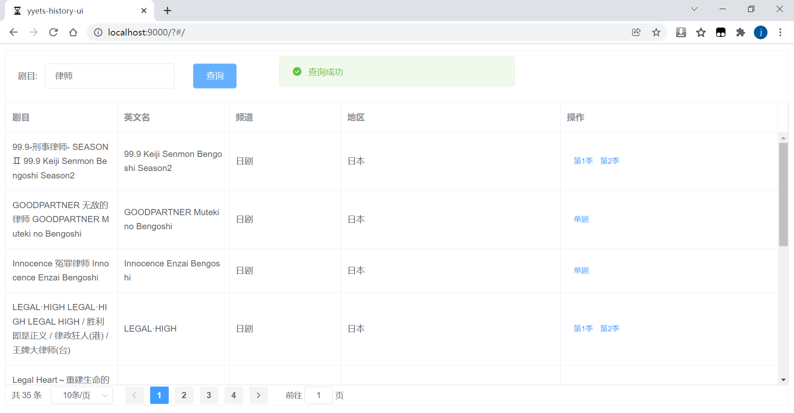
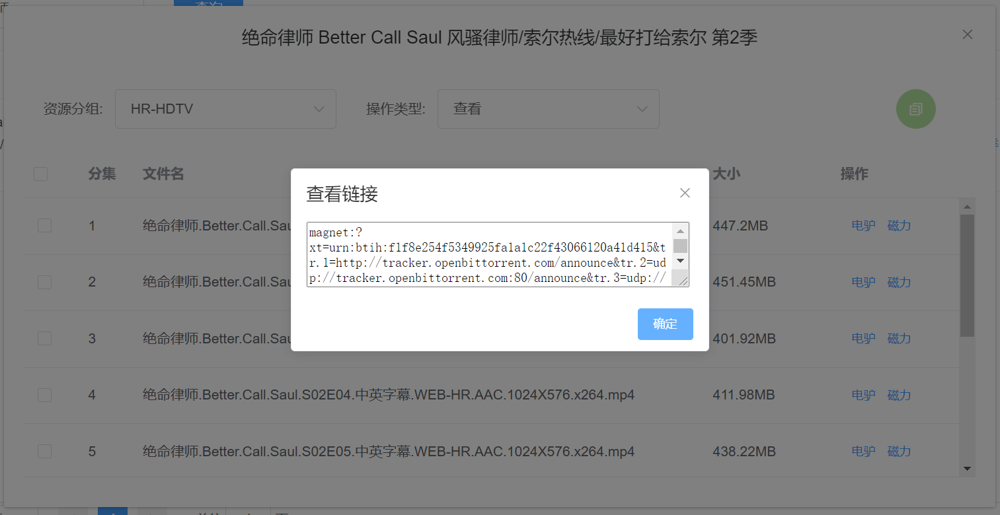

# yyets-snapshot
> 人人影视历史镜像

##### 几点说明

1. 数据源是一个内嵌的sqlite数据库，来自大佬[BennyThink]，github同名；

2. 以盗版资源牟利违法，请大家支持正版。
##### 效果展示

1. 剧目检索
    
  
2. 复制链接
    
  
3. 查看链接
    

##### 配置说明

| 配置项                              | 类型     | 作用                 | 缺省值    | 说明                                                         |
| ----------------------------------- | -------- | -------------------- | --------- | ------------------------------------------------------------ |
| `yyets-history.link-way-filter`     | string[] | 保留的链接类型       | 电驴,磁力 | 所有支持的链接类型:[电驴, 腾讯, 百度云, 磁力, Bilibili, 优酷, 诚通网盘, 微云, 网盘, 搜狐, 乐视, Acfun] |
| `yyets-history.host`                | string   | 域名                 | localhost | 启动前后事件中使用                                           |
| `yyets-history.start-prepare-event` | boolean  | 是否开启启动前置事件 | true      | 前置事件: 检查程序是否已在另一进程启动。支持命令行--参数、jvm -D参数、系统环境变量，不支持yml配置 |
| `yyets-history.start-finish-event`  | boolean  | 是否开启启动后置事件 | true      | 后置事件: 自动弹出浏览器，失败则弹框给出访问地址             |

